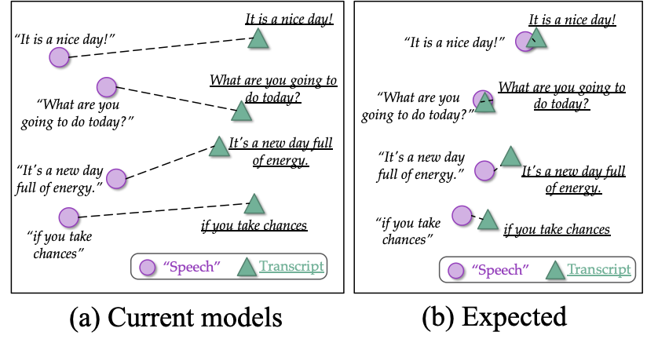

# ConST: Cross-modal Contrastive Learning for Speech Translation 


This is an implementation of NAACL 2022 paper *"Cross-modal Contrastive Learning for Speech Translation"* (read paper [here](https://arxiv.org/abs/2205.02444)). 
The implementation based on [fairseq](https://github.com/pytorch/fairseq) codebase.

**CONTRIBUTION:**
You are also more than welcomed to test our code on your machines, and report feedbacks on results, bugs and performance!

## 👀 Overview
The motivation of our **ConST** model is to learn similar representations for semantically similar speech and text.
<div align="center">
  
</div>

**ConST** (1) inherits the advantages of multi-task learning (as shown in our previous paper [XSTNet](https://www.isca-speech.org/archive/pdfs/interspeech_2021/ye21_interspeech.pdf) (with [code](https://github.com/ReneeYe/XSTNet))),
(2) while employing a contrastive learning approach to bridge the gap between low-level speech representation and text embedding.

<div align="center">
  
</div>

### Result on MuST-C En-X dataset
We report **case-sensitive detokenized BLEU** via sacrebleu toolkit.

| Model      | En-De | En-Es | En-Fr | En-It | En-Nl | En-Pt | En-Ro | En-Ru | Avg.  |
| ---------- |:-----:|:-----:|:-----:|:-----:|:-----:|:-----:|:-----:|:-----:|:-----:|
|ConST-base  |	25.7 |  30.4 |  36.8 | 26.3  |  30.6 |  32.0 | 24.8  |  17.3 |  28.0 |
|ConST-expand|  28.3 |  32.0 |  38.3 | 27.2  |  31.7 |  33.1 | 25.6  |  18.9 |  29.4 |

## 🤗 Huggingface Space Demo available now!
Experience our end-to-end voice translation system on [Huggingface Space](https://huggingface.co/spaces/ReneeYe/ConST-speech2text-translator) now!
Record a sentence in English and translate it into other languages! You are a **TRANSLATOR**! 

HERE IS THE WEBSITE:

https://huggingface.co/spaces/ReneeYe/ConST-speech2text-translator

<div align="center">
  
</div>

*P.S.* Since huggingface space only provides CPU, it will take 12-20 seconds to inference and generate the translation result.

## ⬇️ Download Trained Models
The models are trained based on pytorch. 
You may download all the models at [🤗huggingface model](https://huggingface.co/ReneeYe/ConST_en2x_models).

| **Datasets** |                                           **Model**                                            |                                                                                           **SPM & Vocab**                                                                                            |
|:--------:|:----------------------------------------------------------------------------------------------:|:----------------------------------------------------------------------------------------------------------------------------------------------------------------------------------------------------:| 
| En-De    | [Download](https://huggingface.co/ReneeYe/ConST_en2x_models/resolve/main/models/const_ende.pt) | [SPM model](https://huggingface.co/ReneeYe/ConST_en2x_models/resolve/main/vocabulary/spm_ende.model); [Vocab](https://huggingface.co/ReneeYe/ConST_en2x_models/resolve/main/vocabulary/spm_ende.txt) | 
| En-Es    | [Download](https://huggingface.co/ReneeYe/ConST_en2x_models/resolve/main/models/const_enes.pt) | [SPM model](https://huggingface.co/ReneeYe/ConST_en2x_models/resolve/main/vocabulary/spm_enes.model); [Vocab](https://huggingface.co/ReneeYe/ConST_en2x_models/resolve/main/vocabulary/spm_enes.txt) | 
| En-Fr    | [Download](https://huggingface.co/ReneeYe/ConST_en2x_models/resolve/main/models/const_enfr.pt) | [SPM model](https://huggingface.co/ReneeYe/ConST_en2x_models/resolve/main/vocabulary/spm_enfr.model); [Vocab](https://huggingface.co/ReneeYe/ConST_en2x_models/resolve/main/vocabulary/spm_enfr.txt) | 
| En-It    | [Download](https://huggingface.co/ReneeYe/ConST_en2x_models/resolve/main/models/const_enit.pt) | [SPM model](https://huggingface.co/ReneeYe/ConST_en2x_models/resolve/main/vocabulary/spm_enit.model); [Vocab](https://huggingface.co/ReneeYe/ConST_en2x_models/resolve/main/vocabulary/spm_enit.txt) | 
| En-Nl    | [Download](https://huggingface.co/ReneeYe/ConST_en2x_models/resolve/main/models/const_ennl.pt) | [SPM model](https://huggingface.co/ReneeYe/ConST_en2x_models/resolve/main/vocabulary/spm_ennl.model); [Vocab](https://huggingface.co/ReneeYe/ConST_en2x_models/resolve/main/vocabulary/spm_ennl.txt) |
| En-Pt    | [Download](https://huggingface.co/ReneeYe/ConST_en2x_models/resolve/main/models/const_enpt.pt) | [SPM model](https://huggingface.co/ReneeYe/ConST_en2x_models/resolve/main/vocabulary/spm_enpt.model); [Vocab](https://huggingface.co/ReneeYe/ConST_en2x_models/resolve/main/vocabulary/spm_enpt.txt) | 
| En-Ro    | [Download](https://huggingface.co/ReneeYe/ConST_en2x_models/resolve/main/models/const_enro.pt) | [SPM model](https://huggingface.co/ReneeYe/ConST_en2x_models/resolve/main/vocabulary/spm_enro.model); [Vocab](https://huggingface.co/ReneeYe/ConST_en2x_models/resolve/main/vocabulary/spm_enro.txt) | 
| En-Ru    | [Download](https://huggingface.co/ReneeYe/ConST_en2x_models/resolve/main/models/const_enru.pt) | [SPM model](https://huggingface.co/ReneeYe/ConST_en2x_models/resolve/main/vocabulary/spm_enru.model); [Vocab](https://huggingface.co/ReneeYe/ConST_en2x_models/resolve/main/vocabulary/spm_enru.txt) |

## Training & Generation Instruction
### ⚙️ Requirements and Installation
* [PyTorch](http://pytorch.org/) version >= 1.5.0
* Python version >= 3.6
* For training new models, you'll also need an NVIDIA GPU and [NCCL](https://github.com/NVIDIA/nccl)
```bash
git clone git@github.com:ReneeYe/ConST.git
cd ConST
pip3 install -r requirements.txt
pip3 install --editable ./
```

### 📉 Pre-processing and Training
The instructions of data pre-processing are [here](ConST/prepare_data/README.md).
To train the model, take En-De as an example, you may run:
```bash
bash ConST/scripts/train_en2x.sh de checkpoint/model_saved.
```

### 🤖️ Inference, Generation and Evaluation
We strongly recommend that you average the checkpoints after you get the best checkpoint with highest BLEU on dev set.
```bash
python3 ConST/scripts/average_checkpoints.py --inputs checkpoint/model_saved \
--num-update-checkpoints 10 --checkpoint-upper-bound ${step-to-get-the-best-dev} \
--output ${path-to-averaged-ckpt}
```
Then generate and evaluate your model.
```bash
fairseq-generate data/ --gen-subset tst-COMMON_st --task speech_to_text --prefix-size 1 \
--max-tokens 4000000 --max-source-positions 4000000 --beam 10 \
--config-yaml config_st.yaml  --path ${path-to-averaged-ckpt} \
--scoring sacrebleu
```

## ✏️ Citation
```
@InProceedings{ye2022cross,
  author    = {Rong Ye and Mingxuan Wang and Lei Li},
  booktitle = {Proc. of NAACL},
  title     = {Cross-modal Contrastive Learning for Speech Translation },
  year      = {2022}
}
```
